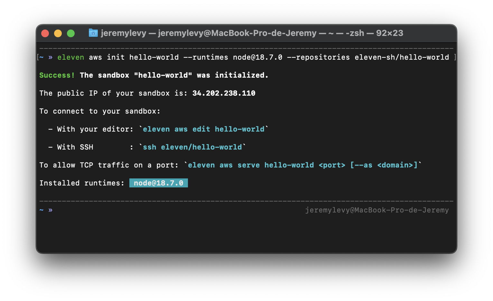
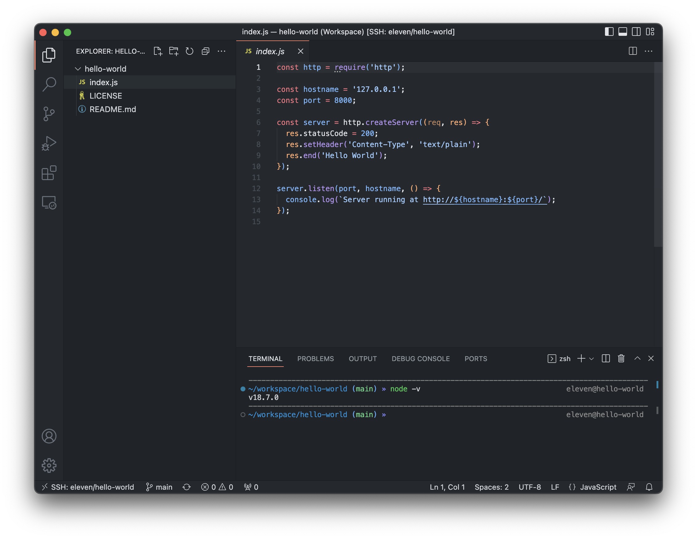

<p align="center">
  
  
</p>

<p align="center">
  <h1 align="center">Eleven</h1>
  <p align="center">Code sandboxes with automatic HTTPS and long running processes. Running in VMs in your cloud provider account.<br />Currently available on <a href="https://github.com/eleven-sh/aws-cloud-provider">Amazon Web Services</a> and <a href="https://github.com/eleven-sh/hetzner-cloud-provider">Hetzner</a>.</p>
</p>

<blockquote align="left">
  ... use it as a remote development environment, to test some code or even to deploy your app. It's up to you!
</blockquote>

```bash
eleven aws init hello-world --runtimes node@18.7.0 --repositories eleven-sh/hello-world
```
<p align="center">

</p>
<blockquote align="left">
  ... now that this sandbox is created, you can connect to it with your preferred editor:
</blockquote>

```bash
eleven aws edit hello-world
```


<blockquote align="left">
  ... finally, now that you have finished working on your application, you may want to deploy it:
</blockquote>

```console
me@home:~$ ssh eleven/hello-world # or use your editor's integrated terminal
```
```console
eleven@hello-world:~/workspace/hello-world$ node index.js # test that your app starts (optional)
Server running at http://127.0.0.1:8000/
^C (Control-C)

eleven@hello-world:~/workspace/hello-world$ forever node index.js
Forever: command started. Run "forever stop" in current path to stop.

eleven@hello-world:~/workspace/hello-world$ exit
Connection to 34.202.238.110 closed.
```
<blockquote align="left">
  ... add an A record pointing to your sandbox's public IP address for the domain that you want to use, then run:
</blockquote>

```console
me@home:~$ eleven aws serve hello-world 8000 --as hello.eleven.sh
Success! The port "8000" is now reachable at: https://hello.eleven.sh

me@home:~$ curl https://hello.eleven.sh
Hello World
```


## Table of contents
- [Requirements](#requirements)
- [Installation (and update)](#installation-and-update)
- [Usage](#usage)
    - [Login](#login)
    - [Init](#init)
        - [--instance-type](#--instance-type)
        - [--runtimes](#--runtimes)
        - [--repositories](#--repositories)
    - [Edit](#edit)
    - [Serve](#serve)
    - [Unserve](#unserve)
    - [Remove](#remove)
    - [Uninstall](#uninstall)
- [Long running processes (Forever)](#long-running-processes-forever)
    - [Start](#start)
    - [Stop](#stop)
- [Frequently asked questions](#frequently-asked-questions)
    - [What do you mean by "code sandbox"?](#-what-do-you-mean-by-code-sandbox)
    - [What will be created in my cloud account?](#-what-will-be-created-in-my-cloud-account)
    - [How much will it cost me?](#-how-much-will-it-cost-me)
- [License](#license)

## Requirements

The Eleven CLI has been tested on Linux and MacOS. Support for Windows is theoretical ([testers needed](https://github.com/eleven-sh/cli/issues/1) 💙).

Before using Eleven, the following dependencies need to be installed:

- [OpenSSH Client](https://www.openssh.com/) (used to access your sandboxes).

Before running the `edit` command, one of the following editors need to be installed:

- [Microsoft Visual Studio Code](https://code.visualstudio.com/) (currently the sole editor supported).

## Installation (and update)

The process required to install the Eleven CLI vary depending on your operating system:

- **On Linux and MacOS,** the easiest way to install it is by running the following command in your terminal:

  ```bash
  curl -sf https://raw.githubusercontent.com/eleven-sh/cli/main/install.sh | sh -s -- -b /usr/local/bin latest
  ```

  This command could be run as-is or by changing:

    - The installation directory by replacing `/usr/local/bin` with your **preferred path**.
    
    - The version installed by replacing `latest` with a **[specific version](https://github.com/eleven-sh/cli/releases)**.

- **On Windows,** the easiest way is by running the following **Powershell** script:

  ```bash
  irm https://raw.githubusercontent.com/eleven-sh/cli/main/install.ps1 | iex
  ```

Once done, you could confirm that Eleven is installed by running the `eleven` command:

```bash
eleven --help
```

#### Update

The command used to install Eleven could also be used to update it to another version.

## Usage

```console
To begin, run the command "eleven login" to connect your GitHub account.	

From there, the most common workflow is:

  - eleven <cloud_provider> init <sandbox_name>   : to initialize a new sandbox

  - eleven <cloud_provider> edit <sandbox_name>   : to connect your preferred editor to a sandbox

  - eleven <cloud_provider> remove <sandbox_name> : to remove an existing sandbox

Usage:
  eleven [command]

Available Commands:
  aws         Use Eleven on Amazon Web Services
  completion  Generate the autocompletion script for the specified shell
  help        Help about any command
  hetzner     Use Eleven on Hetzner
  login       Connect a GitHub account

Flags:
  -h, --help      help for eleven
  -v, --version   version for eleven

Use "eleven [command] --help" for more information about a command.
```

### Login

```bash
eleven login
```
To begin, you need to run the `login` command to connect your GitHub account.

Eleven requires the following permissions:

  - "*Public SSH keys*" and "*Repositories*" to let you access your repositories from your sandboxes.
	
  - "*Personal user data*" to configure Git.

**All your data (including the OAuth access token) are only stored locally in `~/.config/eleven/eleven.yml` (or in `XDG_CONFIG_HOME` if set).**

The source code that implements the GitHub OAuth flow is located in the [eleven-sh/api](https://github.com/eleven-sh/api) repository.

### Init

```bash
eleven <cloud_provider> init <sandbox_name> [--instance-type=<instance_type> --runtimes=<runtimes> --repositories=<repositories>]
```
The `init` command initializes a new sandbox.

To choose the type of instance that will run the sandbox, use the `--instance-type` flag.

To install some runtimes in the sandbox, use the `--runtimes` flag.

To clone some GitHub repositories in the sandbox, use the `--repositories` flag.

#### --instance-type

Valid and default values for the `--instance-type` flag vary depending on the cloud provider used. (See the corresponding cloud provider repository to learn more).

#### --runtimes

The following runtimes could be installed in all sandboxes:

- `docker` (latest only)

- `php` or `php@X.Y` (e.g., php@8.1)

- `java` (latest only)

- `node` or `node@X.Y.Z` (e.g., node@18.7.0) (via nvm)

- `python` or `python@X.Y.Z` (e.g., python@3.1.0) (via pyenv)

- `ruby` or `ruby@X.Y.Z` (e.g., ruby@3.1.2) (via rvm)

- `rust` or `rust@X.Y.Z` (e.g., rust@1.64.0) (via rustup)

- `go` or `go@X.Y.Z` (e.g., go@1.19.0)

- `clang` (latest only)

**All runtimes will default to `@latest` if the version is not set.**

#### --repositories

Repositories may be fully qualified (e.g., `eleven-sh/api`) or without an account name (e.g., `my-repo`). **Your personal account is assumed for repositories without an account name**.

#### Examples

```bash
eleven aws init eleven-api
```
```bash
eleven aws init eleven-api --instance-type m4.large --runtimes node@18.7.0,docker --repositories repo,organization/repo
```

### Edit

```bash
eleven <cloud_provider> edit <sandbox_name>
```
The `edit` command connects your preferred editor to a sandbox.

#### Example

```bash
eleven aws edit eleven-api
```

### Serve

```bash
eleven <cloud_provider> serve <sandbox_name> <port> [--as=<domain_name>]
```
The `serve` command allows TCP traffic on a port in a sandbox.

To reach the port through a domain name (via HTTP(S)), use the `--as` flag. 

**If you want to use more than one domain for a port, you could run the `serve` command multiple times with different domain names**.

#### Examples

```bash
eleven aws serve eleven-api 8000
```
```bash
eleven aws serve eleven-api 8000 --as eleven.sh
eleven aws serve eleven-api 8000 --as www.eleven.sh
```

### Unserve

```bash
eleven <cloud_provider> unserve <sandbox_name> <port>
```
The `unserve` command disallows TCP traffic on a port in a sandbox.

Once TCP traffic is disallowed, the port becomes unreachable from outside.

#### Example

```bash
eleven aws unserve eleven-api 8000
```

### Remove

```bash
eleven <cloud_provider> remove <sandbox_name> [--force]
```

The `remove` command removes an existing sandbox.

The sandbox will be **PERMANENTLY** removed along with **ALL** your un-pushed work. 

**There is no going back, so please be sure before running this command**.

The `--force` flag could be used to remove without confirmation.

#### Examples

```bash
eleven aws remove eleven-api
```
```bash
eleven aws remove eleven-api --force
```

### Uninstall

```bash
eleven <cloud_provider> uninstall
```

The `uninstall` command removes all the infrastructure components used by Eleven from your cloud provider account. (*See the corresponding cloud provider repository for details*).

**All your sandboxes must be removed before running this command.**

#### Example

```bash
eleven aws uninstall
```

## Long running processes (Forever)

In order to ease the process of managing long running processes, a CLI named `forever` is available **inside your sandboxes**.

*(Except for the name, this CLI doesn't have anything in common with [the one available on npm](https://www.npmjs.com/package/forever))*.

### Start

```bash
forever <command>
```
The `forever` command starts the passed command <ins>**in the current path**</ins> and relaunches it in case of exit or after instance restart.

**You cannot have more than one command running per path**.

#### Examples

```bash
forever node index.js
```
```bash
forever docker compose up
```

### Stop

```bash
forever stop
```
The `stop` command stops a command started <ins>**in the current path**</ins>.

## Frequently asked questions

#### > What do you mean by "code sandbox"?

In the context of Eleven, a "code sandbox" is nothing more than a VM, configured and ready-to-use, running in your cloud provider account.

It's called "code sandbox" because the code that you will run in it will be 100% isolated from your local computer (unlike containers).

#### > What will be created in my cloud account?

The infrastructure components that will be created in your account will vary depending on the cloud provider used. 

See the "*Infrastructure components*" section of the corresponding cloud provider repository to learn more (e.g., [here](https://github.com/eleven-sh/aws-cloud-provider#infrastructure-components) for AWS and [here](https://github.com/eleven-sh/hetzner-cloud-provider#infrastructure-components) for Hetzner).

#### > How much will it cost me?

Eleven is 100% free. However, using a VM in your cloud provider account is not. 

See the "*Infrastructure costs*" section of the corresponding cloud provider repository to learn more (e.g., [here](https://github.com/eleven-sh/aws-cloud-provider#infrastructure-costs) for AWS and [here](https://github.com/eleven-sh/hetzner-cloud-provider#infrastructure-costs) for Hetzner).

## License

Eleven is available as open source under the terms of the [MIT License](http://opensource.org/licenses/MIT).
